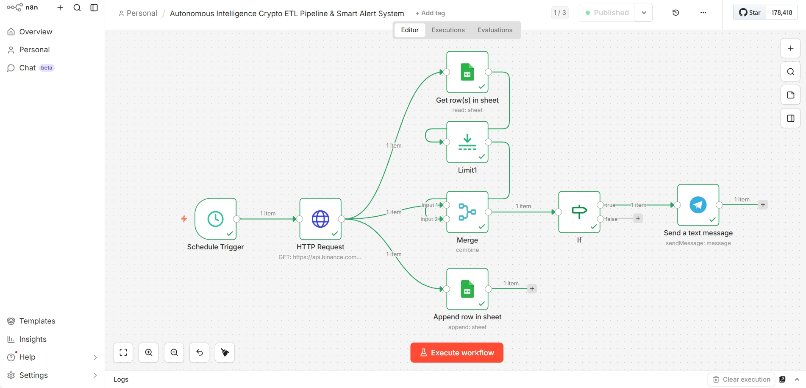
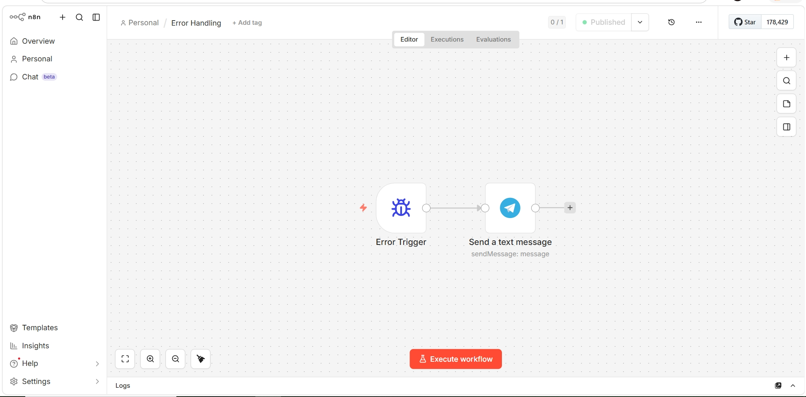

# 🚀 Autonomous Crypto ETL Pipeline with Global Fault Tolerance

## 📌 System Overview
A production-grade, fully automated ETL (Extract, Transform, Load) pipeline built on n8n. This system fetches real-time cryptocurrency data via the Binance API, processes the payload, and logs the structured data into Google Sheets. 

## 🏗️ Architecture: Two-Tier Fault Tolerance
Unlike basic automation scripts, this project implements an industry-standard *Zero-Downtime Architecture* designed for high reliability:
* *Tier 1 (Core Pipeline):* Scheduled autonomous execution for data extraction, transformation, and database loading.
* *Tier 2 (Global Error Handler):* A decoupled, dedicated workflow that acts as a system-wide watchdog.

## 📸 System Architecture

*1. Core ETL Pipeline (Data Extraction & Loading):*


*2. Global Error Handler (Fault Tolerance & Alerts):*
  

## ⚙️ Key Capabilities
* *100% Autonomous Execution:* Runs on a scheduled trigger without manual developer intervention.
* *Global Error Routing:* Dynamically intercepts failures at any node across the workspace (e.g., API timeouts, rate limits, database authentication errors).
* *Real-time Telemetry:* Pushes critical failure alerts directly to Telegram, injecting exact node names and error payloads for instant debugging.

## 🛠️ Tech Stack
* *Automation Engine:* n8n (Node-based workflow automation)
* *APIs & Integrations:* Binance REST API, Google Sheets API, Telegram Bot API
* *Error Handling:* Global Error Trigger, Dynamic JSON mapping

## 🛠️ Prerequisites & Setup

To deploy this autonomous pipeline on your own environment, you need:
* *n8n Environment:* Local (Docker/Desktop) or Cloud instance.
* *Credentials:* Binance REST API Key, Google Cloud Service Account (for Sheets API), and a Telegram Bot Token.

*Installation Steps:*
1. Clone this repository.
2. In your n8n workspace, go to the top right and select *Import from File*.
3. Import both the Main Workflow JSON and the Error Handling.json files.
4. Update the credential nodes with your own API keys.
5. Activate the workflows.

## 🚨 Real-Time Error Telemetry (Payload Example)

The Tier-2 Error Handler dynamically catches failures (like rate limits or timeouts) and injects the exact error payload into a Telegram alert. Here is the output format:

```text
🚨 SYSTEM ALERT: WORKFLOW FAILURE
-----------------------------------
📍 Workflow Name: Autonomous Intelligence Crypto ETL Pipeline & Smart Alert System
❌ Failing Node: HTTP Request
⚠️ Error Message: The connection cannot be established, this usually occurs due to an incorrect host (domain) value
⏰ Time: 2026-03-11T13:10:11.171+05:30
Failed Execution ID: 426
-----------------------------------
Status: Automated rollback initiated.
'''
---
⭐️ *If you find this project helpful, please consider giving it a star to show your support!*
