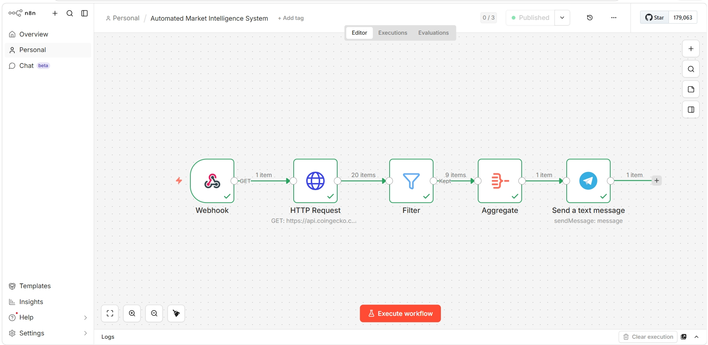

# Crypto Market Alert Bot (n8n + Telegram)

An automated bot built with n8n that tracks live cryptocurrency prices and sends a formatted Telegram message whenever a coin pumps more than 3%.

### 📸 Output: Live Telegram Alerts

##  Why I Built This
Constantly checking charts manually is a waste of time. I wanted to build a backend automation that monitors the market for me and only sends an alert when there is an actual, actionable price movement.

## Tech Stack
* *n8n* (Workflow Automation)
* *REST APIs* (CoinGecko API for live market data)
* *JavaScript* (For parsing and formatting JSON data)
* *Telegram Bot API* (For sending notifications)

## How It Works (The Logic)

1. *Fetch Data:* Connects to the CoinGecko API to get the latest crypto prices. (Added custom User-Agent headers to successfully bypass Cloudflare's bot protection).
2. *Filter Data:* Checks the 24-hour price change. Drops all coins that have pumped less than 3% to keep the feed spam-free.
3. *Format Data:* Takes the raw JSON output and uses JavaScript (.map()) to aggregate the arrays into a clean, readable text format with icons.
4. *Send Alert:* Pushes the final compiled message to a Telegram chat.

---
A practical project built to practice real-world API integration, JS data parsing, and backend automation workflows.
