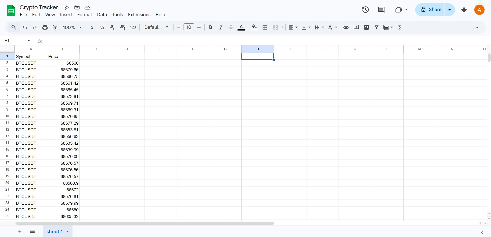

# n8n-automations-ai-workflow-

## Project: Automated Google Sheets Integration
- *Objective:* Automated the creation and management of Google Spreadsheets using n8n and Google Cloud Platform.
- *Tech Stack:* n8n (Localhost), Google Cloud Console (OAuth 2.0), Google Sheets API, Google Drive API.
- *Key Achievements:*
    - Successfully implemented OAuth 2.0 authentication flow.
    - Resolved complex "403 Forbidden" errors related to API propagation.
    - Optimized workflow execution for a 4GB RAM / 128GB SSD hardware environment.
- *Troubleshooting:* Managed API enablement and credential refresh cycles to ensure stable connectivity.

## Project : Real-Time Crypto Data Extraction Pipeline
This is an automated ETL (Extract, Transform, Load) data pipeline. It fetches live Bitcoin (BTCUSDT) prices from the Binance REST API and dynamically logs them into a Google Sheet in real-time. 
## Tech Stack
* *Automation Engine:* n8n (Local Environment)
* *Data Source:* Binance Public API
* *Database:* Google Sheets (OAuth2 Integration)
## Key Achievements
* Eliminated manual data entry by building a fully hands-free data collection system.
* Successfully handled Google API Rate Limiting (HTTP 429 Error) by optimizing the data execution loop.
* Designed a clean, unidirectional data flow (Fetch ➡️ Process ➡️ Store) that runs seamlessly on minimal system resources.
### 1. n8n Automation Workflow

### 2. Live Data Populating in Google Sheets

# 
##  Project : Autonomous BTC Alert System (n8n)
A professional 24/7 autonomous Bitcoin price monitoring system. This project fetches real-time data from the Binance API and sends instant updates to a Telegram bot at scheduled intervals.
## 🚀 Key Features
* *Scheduled Automation*: Triggers every 3 hours (9:00, 12:00, 15:00, etc.) in Asia/Kolkata timezone.
* *Real-time Price Sync*: Directly connected to Binance Ticker API for $BTC prices.
* *High Reliability*: Currently running with a 0% failure rate.

### 1. Workflow Logic
The visual structure of the automation nodes.

### 2. Execution History
Evidence of consistent autonomous performance and successful triggers.

### 3. Telegram Alert
Sample of the final price notification received on Telegram.

##  How to Setup
1. Download the autonomous-btc-alert-system.json file.
2. Import it into your *n8n* instance.
3. Create new *Telegram API credentials* in n8n with your Bot Token.
4. Replace the Chat ID in the Telegram node with your own ID.
5. Switch the workflow to *Published* mode.

---
Created by a BCA Student interested in Data Science and Automation.
