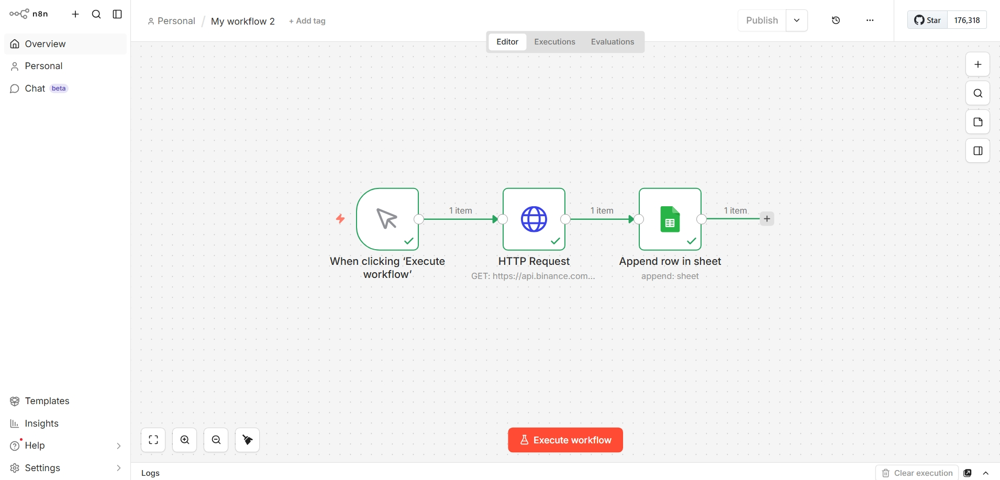
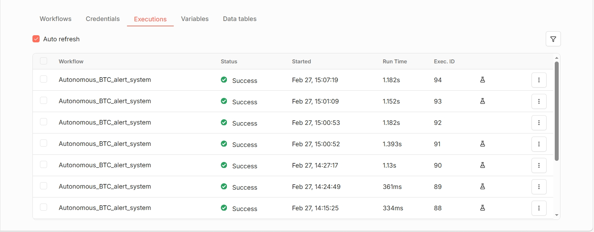
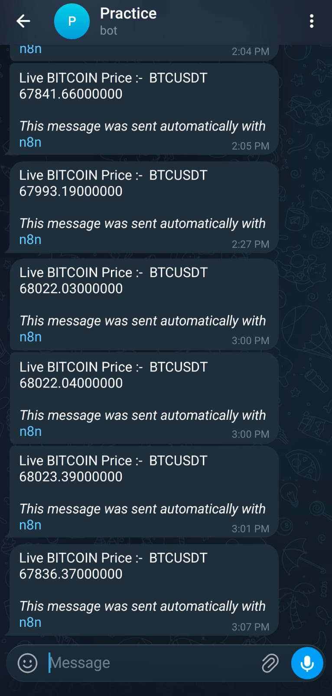

##  Project : Autonomous BTC Alert System (n8n)
A professional 24/7 autonomous Bitcoin price monitoring system. This project fetches real-time data from the Binance API and sends instant updates to a Telegram bot at scheduled intervals.
## 🚀 Key Features
* *Scheduled Automation*: Triggers every 3 hours (9:00, 12:00, 15:00, etc.) in Asia/Kolkata timezone.
* *Real-time Price Sync*: Directly connected to Binance Ticker API for $BTC prices.
* *High Reliability*: Currently running with a 0% failure rate.

### 1. Workflow Logic
The visual structure of the automation nodes.

### 2. Execution History
Evidence of consistent autonomous performance and successful triggers.

### 3. Telegram Alert
Sample of the final price notification received on Telegram.

##  How to Setup
1. Download the autonomous-btc-alert-system.json file.
2. Import it into your *n8n* instance.
3. Create new *Telegram API credentials* in n8n with your Bot Token.
4. Replace the Chat ID in the Telegram node with your own ID.
5. Switch the workflow to *Published* mode.

---
Created by a BCA Student interested in Data Science and Automation.
