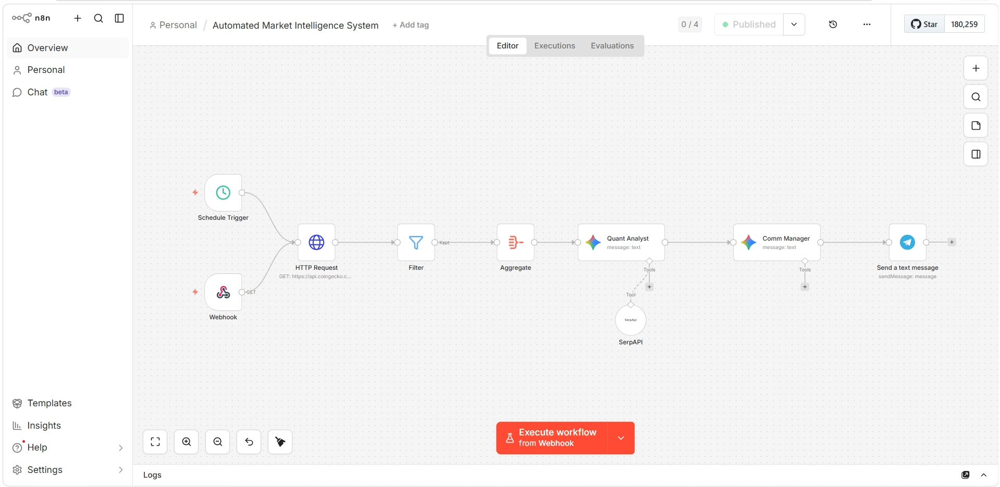
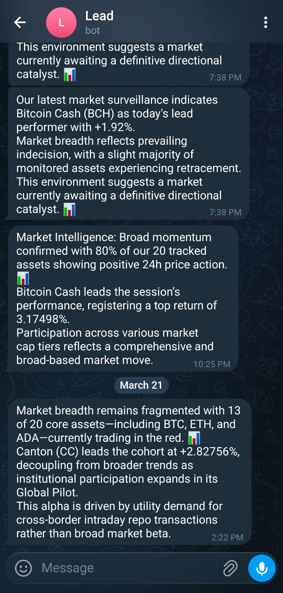

# Multi-Agent Crypto Pipeline (V1)

An automated n8n pipeline that monitors the cryptocurrency market for token pumps and uses a sequential dual-agent LLM architecture to analyze data and deliver formatted Telegram alerts.

## ⚙️ How It Works (Architecture)

This pipeline operates on a fixed logic flow without external autonomous tool execution. It processes structured JSON data through the following stages:

1. *Trigger:* Runs on a scheduled cron job (or manual Webhook) to fetch the top crypto assets.
2. *Data Fetch:* Makes an HTTP GET request to the CoinGecko API.
3. *Signal Filtering:* Drops all irrelevant data. Only assets with a price_change_percentage_24h > 3% are allowed to pass.
4. *Aggregation:* Compiles the filtered data points into a single, clean JSON string to prevent token-window overload.
5. *Agent 1 (Quant Analyst):* A Gemini 3 Flash model with a strict system prompt. It analyzes the raw JSON, calculates market breadth, and extracts the top performer. No conversational text is generated.
6. *Agent 2 (Comm Manager):* A secondary Gemini model that takes the raw mathematical output from Agent 1 and formats it into a high-status, readable Telegram alert for end-users.
7. *Delivery:* Pushes the final message via the Telegram Bot API.

## 🛠️ Tech Stack

* *Automation Engine:* n8n (Self-hosted/Local)
* *LLM Provider:*Google Gemini API (gemini - 3 flash)
* *Data Source:* CoinGecko API (Free Tier)
* *Notification Channel:* Telegram Bot API
  
## 📸 Screenshots

### 1. The n8n Workflow Canvas
> (Add your n8n pipeline screenshot here - the one showing all nodes connected from Webhook to Telegram)

### 2. The Final Telegram Output
> (Add the screenshot of the clean VIP alert on your phone)

## 🚀 Setup & Execution

1. Import the workflow.json file into your n8n instance.
2. Add your Google Gemini API key in the credentials section.
3. Add your Telegram Bot Token and Chat ID.
4. Set the Schedule node to your preferred timeframe (e.g., Every 1 Hour) to avoid HTTP 429 Rate Limit errors.
5. Toggle the workflow to *Active*.
